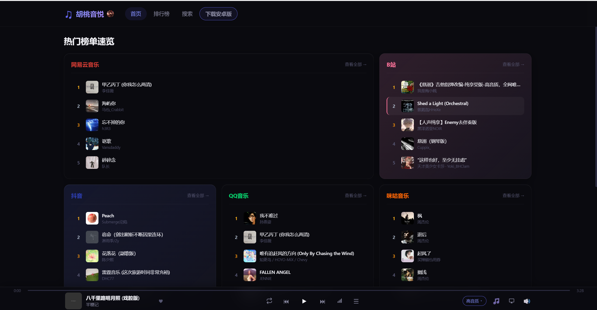
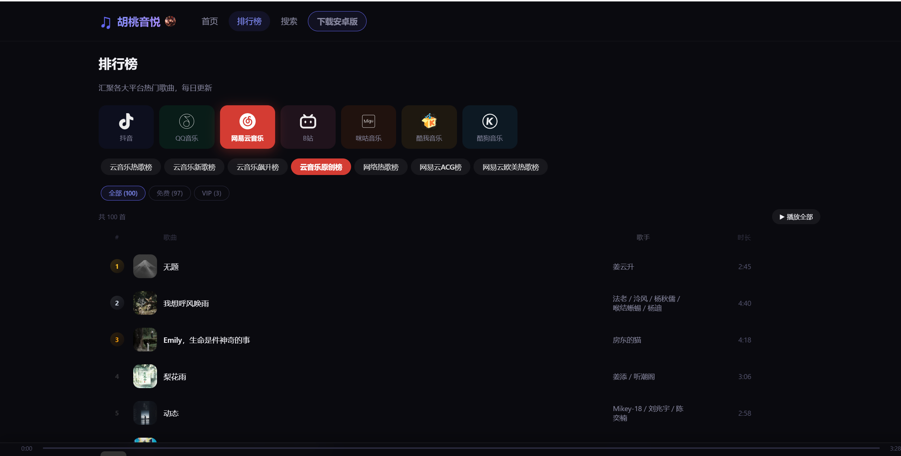
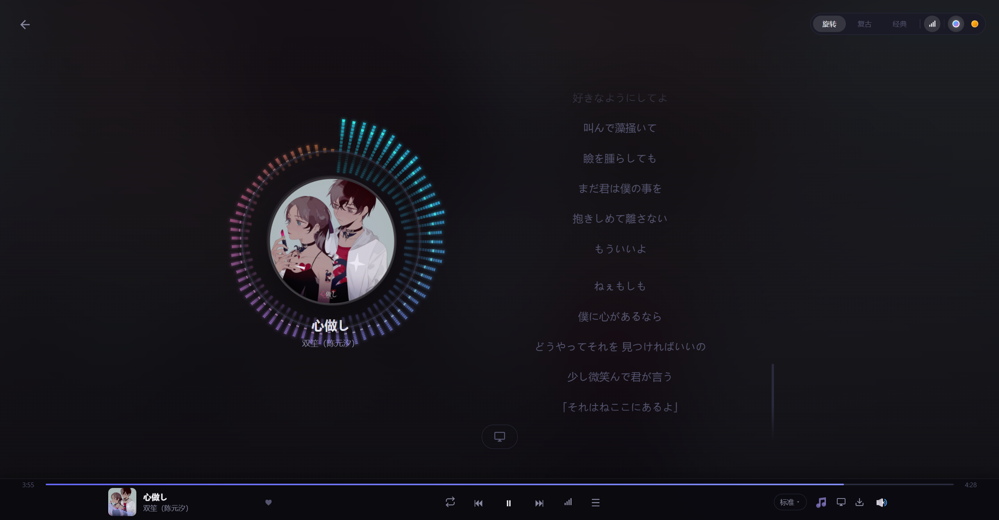

# 胡桃音悦 / 胡桃音乐 (Hutao Music)

一个多平台聚合的 Web 音乐播放器，支持一站搜索、播放来自 QQ音乐、网易云音乐、B站、抖音、咪咕音乐、酷我音乐、酷狗音乐的歌曲，并提供歌词、音质切换、收藏、下载等完整功能。

> 用于学习与个人使用，所有音源均来自各平台公开接口，请尊重各平台版权与条款，勿用于商业用途。

## 在线体验

**访问地址：[https://hutaolv.com](https://hutaolv.com)**

## 界面预览

### 首页 - 热门榜单速览


### 排行榜 - 七大平台榜单，悬浮操作按钮


### 歌词页 - 旋转封面 + LED频谱 + 歌词高亮


## 功能特性

- **多平台聚合**
  - 一键搜索 QQ音乐 / 网易云音乐 / B站 / 咪咕音乐 / 酷我音乐 / 酷狗音乐的歌曲与歌手
  - 胡桃搜：第三方聚合搜索，跨平台快速匹配
  - 七大平台每日排行榜榜单（每日更新）
- **播放器**
  - 播放列表、播放全部、顺序 / 单曲循环 / 随机三种模式
  - 音质切换：标准 / 高音质 / 无损（按歌曲实际可用档位展示）
  - 进度条拖动、音量控制、静音
  - VIP 歌曲拦截提示（5 秒后自动跳过下一首）
  - 三种播放器样式：旋转 / 复古黑胶 / 经典
  - 多标签页播放同步（localStorage storage 事件）
- **歌词**
  - LRC 歌词面板跟随播放高亮
  - 封面频谱动画（彩虹 / 琥珀两种配色，可独立开关）
  - 歌词颜色拾取器（颜色实时同步到桌面歌词）
  - 桌面歌词（可拖动，支持小 / 中 / 大字号档位）
  - B站视频自动取 CC 字幕 / AI 字幕转歌词，无字幕时回退弹幕
- **收藏**：本地收藏（IndexedDB）+ 收藏爱心动画（收藏 3 倍放大、取消裂开心碎）
- **下载**：一键下载当前播放歌曲（支持音质选择，移动端 fetch blob 兼容跨域下载）
- **歌手详情**：查看歌手歌曲列表，支持翻页
- **UI 设计**
  - 玻璃拟态（Glassmorphism）设计风格，毛玻璃设置弹窗
  - Bento 不对称网格首页布局
  - 封面主色调提取生成径向渐变背景
  - 药丸标签、分段控制器、iOS 风格开关、金属质感排名徽章、悬浮渐入交互

## 技术栈

| 层 | 技术 |
|---|---|
| 前端 | Vue 3 + TypeScript + Vite + Pinia + Vue Router |
| 后端 | Node.js + Express + axios |
| 移动端 | Capacitor（Android APK，R8 混淆 + 资源压缩） |
| 部署 | Docker（单容器托管前后端） |

## 目录结构

```
├── src/                  # 前端源码
│   ├── components/       # 播放条 / 歌曲卡片 / 播放列表等组件
│   ├── views/            # 首页、排行榜、搜索、歌手详情、歌词页
│   ├── stores/           # Pinia 播放器状态
│   ├── services/         # 前端 API 调用
│   ├── utils/            # 收藏 / 频谱 / 存储 / 下载工具
│   ├── styles/           # 全局 CSS（玻璃拟态变量、品牌渐变）
│   └── data/             # 平台列表与品牌色
├── server/               # Node 后端
│   ├── index.js          # Express 入口（API + 静态托管 dist）
│   ├── routes/           # charts / search / song 路由
│   └── services/         # 各平台解析实现
├── public/icons/         # 应用图标
├── Dockerfile            # 容器构建（安装依赖 + 构建前端）
├── docker-compose.yml    # 一键部署
└── vite.config.ts        # Vite 配置（含 /api 开发代理）
```

## 本地开发

要求 Node.js ≥ 20.19（vite 8 / TypeScript 6）。

```bash
# 1. 安装前端依赖
npm install

# 2. 安装后端依赖
npm install --prefix server

# 3. 同时启动前端(5173) + 后端(3001)
npm run dev:all
# 单独启动：
#   npm run dev        # 前端，访问 http://localhost:5173，/api 自动代理到 3001
#   npm run server     # 后端，访问 http://localhost:3001
```

## 构建 & 运行

```bash
npm run build        # 构建前端到 dist/
npm run server       # 启动服务（自动托管 dist），默认端口 3001
```

## Android APK 打包（Capacitor）

用 Capacitor 将前端打包成 Android APK。要求本机已装 Node.js ≥ 20.19 与 JDK ≥ 21，并配置 `ANDROID_HOME` 指向 Android SDK。

```bash
# 1. 安装 Capacitor 依赖
npm install
npm install -D @capacitor/cli @capacitor/android

# 2. 生成 Android 工程（首次运行，之后可跳过）
npx cap add android

# 3. 构建前端并同步到 Android 工程（打包前必须执行，命令中替换为你的服务器地址）
$env:VITE_API_BASE='https://你的域名'或者 'http://你的服务器地址:3001'
npm run build
npx cap sync android

# 4. 编译 Release APK（R8 混淆 + 资源压缩，需 JDK 21）
$env:JAVA_HOME='<JDK 21 所在目录>'
$env:ANDROID_SDK_ROOT=$env:ANDROID_HOME
.\android\gradlew.bat -p android :app:assembleRelease --no-daemon
```

产物位于 `android\app\build\outputs\apk\release\胡桃音悦-<版本号>.apk`，拷到手机安装即可。

要点：

- `VITE_API_BASE` 只在本终端会话注入，**不写死进代码**，指向服务器根地址（不含 `/api`）；若服务器走 HTTPS 改为 `https://域名` 即可
- `android\` 工程与 `capacitor.config.ts` 已提交到仓库；首次在新机器打包前需重跑 `npx cap add android`
- `capacitor.config.ts` 中 `androidScheme: 'http'` 用于让 WebView 能直接请求明文接口（避免 mixed content 拦截）；配套 `android\app\src\main\AndroidManifest.xml` 已开启 `usesCleartextTraffic`
- 应用图标：PWA 与 APK 均使用 `public/icons/hutao.png`（APK 侧已按各密度缩放进 `android\app\src\main\res\mipmap-*`），打包前用 sharp 压缩至 ~50KB 以内减小包体积
- APK 启用 R8 混淆 + 资源压缩（`minifyEnabled true` + `shrinkResources true`），Release 包约 3.2MB
- APK 内不会注册 Service Worker（本地 assets 无需缓存），避免旧 SW 缓存导致覆盖安装白屏；网页版仍正常使用 PWA
- 修改前端代码后重新打包：重跑第 3、4 步即可（建议 `gradlew clean assembleRelease` 确保重新打包 web 资源）

### 发布新版本

1. **递增版本号（三处同步）**：
   - `android\app\build.gradle` 的 `versionName`
   - `src\version.js` 的 `APP_VERSION`
   - 服务器 `server\downloads\version.json` 的 `version`
2. 重新打包后，把 `android\app\build\outputs\apk\release\胡桃音悦-<版本号>.apk` 复制到服务器 `server\downloads\`（该目录已挂载进容器，替换即生效，无需重建镜像），并更新 `version.json` 中的版本号与更新说明 `notes`。
3. 用户手机上的 APK 启动时会请求 `/api/version`，检测到更高版本后弹窗提示「下载更新」，跳转系统浏览器下载安装包，下载完成后到通知栏点击安装。

> 安装包下载地址形如 `http://<服务器>:3001/downloads/胡桃音悦.apk`（仓库 `.gitignore` 已忽略 APK 文件，`version.json` 正常提交）。

## Docker 部署

单容器同时托管前端构建产物与后端 API，一键部署：

```bash
docker compose up -d --build
curl http://localhost:3001/api/health   # 期望 {"status":"ok"}
```

- 端口：默认 `3001`，可通过环境变量 `PORT` 修改
- 前端以 `npm run build` 的产物（`dist/`）由 Express 静态托管 + SPA 回退

### 反向代理（Nginx 示例）

多个项目共用一台服务器时，用 Nginx 按域名分发到不同容器端口：

```nginx
server {
    listen 80;
    server_name your-domain.com;
    location / {
        proxy_pass http://hutao-music:3001;   # 同网络容器用容器名访问
        proxy_set_header Host $host;
        proxy_set_header X-Real-IP $remote_addr;
    }
    location /api/proxy/audio {               # 音频流不缓冲，边下边播
        proxy_pass http://hutao-music:3001;
        proxy_buffering off;
        proxy_read_timeout 300s;
    }
}
```

> 容器间需处于同一自定义 Docker 网络（如 `webnet`，通过 `docker network connect` 加入），否则容器名无法解析。

## API 概览

| 路径 | 说明 |
|---|---|
| `GET /api/search?keyword=&type=&platform=` | 搜索（type 分歌曲 / 歌手，platform 可选指定平台） |
| `GET /api/search/thirdparty?keyword=&platform=` | 胡桃搜（第三方聚合搜索） |
| `GET /api/charts?platform=` | 各平台排行榜 |
| `GET /api/song/...` | 播放地址 / 歌词 / 音质探测 |
| `GET /api/proxy/image?url=` | 图片防盗链代理 |
| `GET /api/proxy/audio?url=` | 音频防盗链代理（流式转发，支持 Range） |
| `GET /api/health` | 健康检查 |

## 免责声明

- 本项目仅用于技术学习与个人使用，音源版权归各平台所有，请勿用于商业用途
- 现状依赖各平台公开接口，接口变动可能导致部分功能失效
